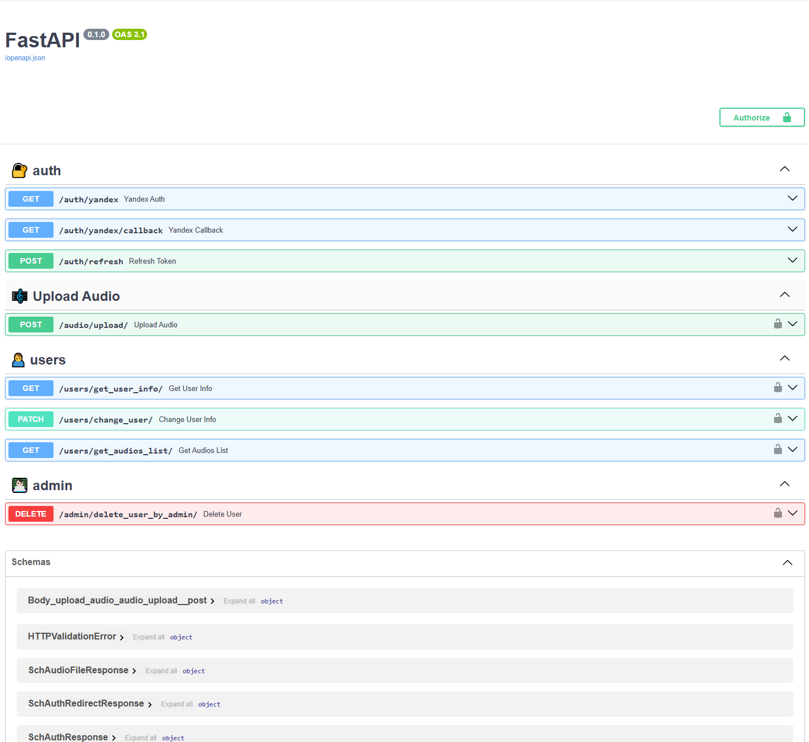

# FastAPI Audio Service

## Содержание
- [Описание проекта](#описание-проекта)
- [Стек](#стек)
- [Структура проекта](#структура-проекта)
- [Переменные окружения](#переменные-окружения)
- [Запуск проекта на сервере Linux](#запуск-проекта-на-сервере-linux)
  - [Шаг 1: Установка Docker и Docker Compose](#шаг-1-установка-docker-и-docker-compose)
    - [1.1 Установка Docker](#11-установка-docker)
    - [1.2 Установка Docker Compose](#12-установка-docker-compose)
  - [Шаг 2: Подготовка файла docker-composeyml](#шаг-2-подготовка-файла-docker-composeyml)
  - [Шаг 3: Запуск контейнеров](#шаг-3-запуск-контейнеров)
- [Интерфейс Swagger API](#интерфейс-swagger-api)

## Описание проекта

Этот проект представляет собой сервер на **FastAPI**, предназначенный для обработки аудиофайлов и пользователей, связанных с их аккаунтами. Основные функции включают:
- Авторизация через Яндекс OAuth.
- Управление пользователями (создание в процессе аутентификации, обновление).
- Загрузка и управление аудиофайлами для каждого пользователя.
- Обновление токенов с использованием JWT.
- Удаление пользователей от имени супер-пользователя (администратора)

## Стек

- **FastAPI** - для создания высокопроизводительных API.
- **SQLAlchemy** - для работы с базой данных.
- **PostgreSQL** - в качестве СУБД.
- **Pydantic** - для валидации данных.
- **JWT (JSON Web Tokens)** - для аутентификации и авторизации.
- **asyncio** - для асинхронного программирования и оптимизации работы с базой данных.

## Структура проекта
 ```bash
│   main.py 
├───audio_storage
├───config
│   └───app_config.py
├───database
│   └───database_helper.py
├───models
│   └───base_model.py
│   └───users.py
├───repositories
│   └───audio_db_repo.py
│   └───auth_router_repo.py
│   └───upload_audio_repo.py
│   └───users_db_repo.py
├───routers
│   └───admin_router.py
│   └───audio_router.py
│   └───auth_router.py
│   └───users_router.py
├───schemas
│   └───schemas.py
```

| Название                | Описание                                              |
|-------------------------|-------------------------------------------------------|
| `main.py`               | Главный файл для запуска приложения                   |
| `audio_storage`         | Папка для хранения аудиофайлов (если они сохраняются на сервере) |
| `config/app_config.py`  | Конфигурация приложения (например, переменные окружения) |
| `database/database_helper.py` | Вспомогательные модули для работы с базой данных  |
| `models/base_model.py`  | Базовая модель для работы с SQLAlchemy                |
| `models/users.py`       | Модели для работы с пользователями в базе данных     |
| `repositories/audio_db_repo.py` | Репозиторий для работы с аудиофайлами в базе данных |
| `repositories/auth_router_repo.py` | Репозиторий для работы с авторизацией и токенами |
| `repositories/upload_audio_repo.py` | Репозиторий для работы с загрузкой аудиофайлов  |
| `repositories/users_db_repo.py` | Репозиторий для работы с пользователями в базе данных |
| `routers/admin_router.py` | Роутер для административных эндпоинтов              |
| `routers/audio_router.py` | Роутер для работы с аудиофайлами                    |
| `routers/auth_router.py` | Роутер для работы с авторизацией и токенами         |
| `routers/users_router.py` | Роутер для работы с пользователями                  |
| `schemas/schemas.py`    | Схемы для валидации данных с помощью Pydantic        |
## Переменные окружения
 - **YANDEX_CLIENT_ID** **YANDEX_CLIENT_SECRET** для настройки авторизации через Яндекс.
 - **DATABASE_URL** для подключения к базе данных (PostgreSQL).
 - **SECRET_KEY** для создания и валидации JWT токенов.
 - **TOKEN_EXPIRE_HOURS** определение времени жизни Access-токена (в часах)
 - **REFRESH_TOKEN_EXPIRE_DAYS** определение времени жизни Refresh-токена (в днях)

## Запуск проекта на сервере Linux
# FastAPI Audio Service

Этот проект представляет собой FastAPI сервис для работы с аудиофайлами, использующий PostgreSQL для хранения данных. В этом README представлен способ запуска приложения с помощью Docker и Docker Compose.

## Шаг 1. Установка Docker и Docker Compose на Linux

### 1.1. Установка Docker

1. Обновите информацию о пакетах:

    ```bash
    sudo apt update
    ```

2. Установите необходимые зависимости:

    ```bash
    sudo apt install apt-transport-https ca-certificates curl software-properties-common
    ```

3. Добавьте GPG ключ для Docker:

    ```bash
    curl -fsSL https://download.docker.com/linux/ubuntu/gpg | sudo apt-key add -
    ```

4. Добавьте репозиторий Docker:

    ```bash
    sudo add-apt-repository "deb [arch=amd64] https://download.docker.com/linux/ubuntu $(lsb_release -cs) stable"
    ```

5. Установите Docker:

    ```bash
    sudo apt update
    sudo apt install docker-ce
    ```

6. Запустите и включите Docker на старте системы:

    ```bash
    sudo systemctl start docker
    sudo systemctl enable docker
    ```

7. Проверьте установку:

    ```bash
    sudo docker --version
    ```

### 1.2. Установка Docker Compose

1. Скачайте последнюю версию Docker Compose:

    ```bash
    sudo curl -L "https://github.com/docker/compose/releases/download/$(curl -s https://api.github.com/repos/docker/compose/releases/latest | jq -r .tag_name)/docker-compose-$(uname -s)-$(uname -m)" -o /usr/local/bin/docker-compose
    ```

2. Сделайте Docker Compose исполняемым:

    ```bash
    sudo chmod +x /usr/local/bin/docker-compose
    ```

3. Проверьте установку:

    ```bash
    docker-compose --version
    ```

## Шаг 2. Подготовка файла `docker-compose.yml`

Скачайте или создайте файл `docker-compose.yml` в корне вашего проекта. Этот файл должен выглядеть следующим образом:

**Обратите внимание! В данном docker-compose файле отсутствуют переменные окружения, которые необходимо указать**

```yaml
version: '3.8'

services:
  db:
    image: postgres:16
    container_name: postgres_db
    restart: always
    environment:
      POSTGRES_USER: #<--логин postgres
      POSTGRES_PASSWORD: #<--пароль postgres
      POSTGRES_DB: название #<--базы данных
    ports:
      - "5432:5432"
    #volumes: <--- укажите тут корректное значения, чтобы данные БД сохранялись за пределами контейнера
    #  - postgres_data:/var/lib/postgresql/data

  fastapi_app:
    image: dontworrybro/fastapi-audio-service:v1.0
    container_name: fastapi_audio_service
    restart: always
    depends_on:
      - db
    environment:
      DATABASE_URL: #<--ссылка подключения к БД пример: "postgresql+asyncpg://postgres:postgres@db:5432/db_name"
      SECRET_KEY: #<--секретный ключ для подписи JWT
      YANDEX_CLIENT_ID: #<--клиент ID яндекса для аутентификации пользователя
      YANDEX_CLIENT_SECRET: #<--секретный ключ яндекса для аутентификации пользователя
      TOKEN_EXPIRE_HOURS: #<--время в часах (сколько будет действовать ACCESS токен)
      REFRESH_TOKEN_EXPIRE_DAYS: #<--время в днях (сколько будет действовать REFRESH токен)
    ports:
      - "8000:8000"
    #volumes: <--- укажите тут корректное значение, чтобы файлы сохранялись вне контейнера
    #  - .:/app
    command: ["python", "app/main.py"]

volumes:
  postgres_data:
    driver: local
```
## Шаг 3. Запуск контейнеров
1. Перейдите в директорию проекта, где находится файл **docker-compose.yml**


2. Запустите Docker Compose:
 ```bash
   sudo docker-compose up -d
```
Для работы с API:
```bash
http://<ваш_сервер_IP>:8000
```
Для просмотра документации API:
```bash
http://<ваш_сервер_IP>:8000/docs
```
3. Для остановки контейнеров:
```bash
sudo docker-compose down
```

## Интерфейс Swagger API
